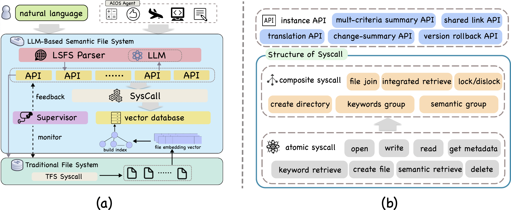
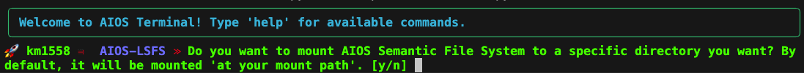

# AIOS-LSFS
This is the official code implementation of paper [From Commands to Prompts: LLM-based Semantic File System for AIOS](https://arxiv.org/pdf/2410.11843)

## 🏠 Architecture of LSFS
<p align="center">

</p>

## 🚀 Quickstart

### ⚙️ Installation
```
conda create -n lsfs python=3.11
conda activate lsfs
pip install -r requirements.txt
```

### 🏃Run
· Please make sure you have read the instructions in [AIOS](https://github.com/agiresearch/AIOS) to set up the environment and launch the AIOS kernel. 

· You need to create a folder to put the files you want to manage, Our default folder is ```./root```.

After that, you can run the following command to start the LSFS terminal.

```
python scripts/run_terminal.py
```
When you successfully enter the system, the interface is as follows:

<p align="center">

</p>

### ❗️Notice
· After entering the mount file, you need to type ```c``` and ```tab``` in the aios kernel to ensure that the system continues to run

· You need to add your LLM API to ```./aios/config/config.yaml```

Then you can start interacting with the LSFS terminal by typing natural language commands. 

## 📎 Functions
The following operations are available on lsfs today, and more will be added in the future:
| Function Name | Description |
|-----------------|------------|
| create semantic file/directory | We manage files through a vector database | 
| keywords/semantic retrieve | We supports multi-keyword search and semantic search function, and semantic search returns the n most desired files |
| Rollback | Supports file rollback to the previous version of the change.| 
| Link| Generate shareable links.| 
| ......| ......| 

Please read our paper for a detailed natural language input template.

## 🖇️ Reuse
LSFS provides operations and their implementation procedures that inspired by RDBMS and hard to achieve in traditional file system, which can be used for further development of semantic file systems in the future. Here are some examples:

| Function Name | Description |
|-----------------|------------|
| Group By | Regroup files containing the same keywords or topics into a new folder. | 
| Join| Merge the contents of the two files conditionally. | 
| ......| ...... | 


## 🌹Reference
If you find this project useful, please cite our paper:

```
@inproceedings{
  shi2025from,
  title={From Commands to Prompts: {LLM}-based Semantic File System},
  author={Zeru Shi and Kai Mei and Mingyu Jin and Yongye Su and Chaoji Zuo and Wenyue Hua and Wujiang Xu and Yujie Ren and Zirui Liu and Mengnan Du and Dong Deng and Yongfeng Zhang},
  booktitle={The Thirteenth International Conference on Learning Representations},
  year={2025},
  url={https://openreview.net/forum?id=2G021ZqUEZ}
}
```